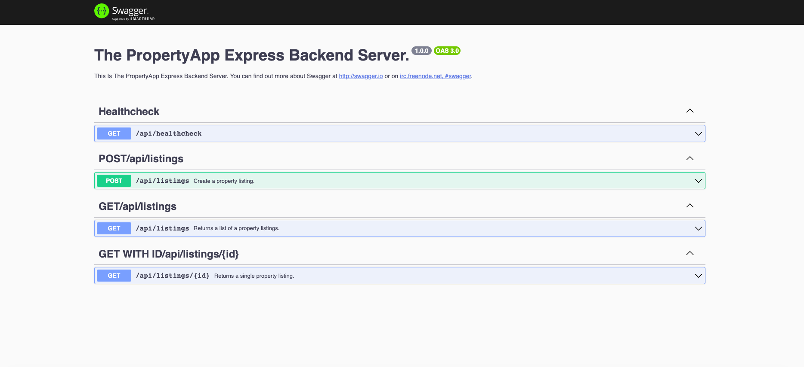

# PropertyApp TypeScript Express Backend Server

  


A REST API built using TypeScript, Node.JS server that returns property listings for The PropertyApp.

- [Prerequisites](#prerequisites)
- [Quick overview](#quick-overview)
  - [Project Structure](#project-structure)
- [Local/native environment](#localnative-environment)
  - [Install app](#install-app)
  - [Run app](#run-app)
- [Docker environment](#docker-environment)
  - [Build image](#build-image)
  - [Run container](#run-container)
- [RESTAPI endpoint](#restapi-endpoint)
- [RESTAPI docs](#restapi-docs)
- [Testing](#testing)

## Prerequisites

- **[node](https://nodejs.org/en/download/)** v18.x.x or higher
- **[npm]** v8.x.x or higher
- **[Docker]**(https://docs.docker.com/get-docker/) 20.x.x or higher

## Quick overview

### Project structure

The PropertyApp is using a Monorepo with npm workspaces.

- **Packages**: Is where the all the packages of our application live.
  - **Backend-Node**: Is where the backend NodeJS application in located.
  - **Frontend-React**: Is where the frontend React application in located.

The project structure within API is as following:

- All file names are written in kabab-case.

* **build**: Contains the converted javascript files when typescript is compiled.
* **src**: This is where our typescript files live.
  - **mocks**: Contains the functions that create mock data for tests (`jest.setup.ts`)
  - **config**: Contains the set up files for the S3 Bucket (For image uploading).
  - **config/database**: Contains the Sequelize & Sqlite3 database connection (`db.ts`).
  - **controllers**: The controllers handles all the logic coming from services. (`handler-refactory.ts`)
  - **error**: The middleware that handles errors is in this folder. (`App-error.ts`)
  - **middleware**: This contains the custom middlewares for the application. (`ImageHandling.ts`)
  - **models**: The schema definition of the Model (the structure or shape of documents within a collection in Sqlite3 & Sequelize) and it's types.(`SquelizePropertyModel.ts`)
  - **routes**: The routes that handles access to our apps resources - each service has its own router. (`employee-bio-router.ts`)
  - **services**: The services contains the database queries and returning objects or throwing errors.(`property-listings-service.ts`)
  - **types**: Where app-wide types are stored. (`environment.d.ts`)

[Back to ToC](#propertyapp-typescript-express-backend-server)

## Local/Native Environment

- **NODE_ENV**: Is by default set to devolopment.

### Install App

You'll need to clone the Repository

```bash
$ git clone https://github.com/Bruneljohnson/PropertyApp.git
$ cd packages/backend-node
$ npm install
```

### Run App

Go into the root folder of the project, and also make sure no instance of the app is running on this machine before running the below:

```bash
$ npm start
```

The above runs the app and listens on port 8080, if this port is not available or if you wish to run it on a different port then do the below:

```bash
$ PORT=<another port number> npm start
```

Once the server is up and running, you can also take a look at the [RESTAPI endpoint](#restapi-endpoint) and [RESTAPI docs](#restapi-docs) resources to see how to call the endpoint in your application or via postman, and what results to expect.

[Back to ToC](#propertyapp-typescript-express-backend-server)

## Docker Environment

This section expects familiarity about Docker concepts and using Docker. Use docker image builds as an additional way to check for application development time and runtime reliability, integrity and portability in an isolated environment.

Ensure that Docker Daemon is running and you see the whale-carrying-containers icon on your taskbar or in your activity/process manager, before going further to the next sub-section.

### Build Image

**Note** make sure you are in the root folder of api.

```bash
$ cd api
$ docker build -t {your-dockerhub-username}/propertyapp-backend:latest -f ./Dockerfile .
```

_Please build the image the first time and rebuild it each time the project changes in order to be in sync with the changes._

### Run Container

Go into the root folder of the project, and also make sure no instance of the app is running on this machine before running the below:

```bash
$ docker run -d -p 8080:80 --name propertyappserver {your-dockerhub-username}/propertyapp-backend:latest
```

Once the server is up and running, you can also take a look at the [RESTAPI endpoint](#restapi-endpoint) and [RESTAPI docs](#restapi-docs) resources to see how to call the endpoint in your application or from the command-line, and what results to expect.

## RESTAPI Endpoint

You can access the RESTAPI endpoint:

http://localhost:8080/api/listings

For a GET requst you'll have an return object like this

and you get an output like this: (this is the just an example of how the data looks like.)
**ImageUrl** We request a SignedUrl from AWS to allow access to our private S3 Bucket.

```json
{
  "status": "success",
  "data": {
    "id": "205a2dfb-a764-4fd0-8b78-8c830e125f4c",
    "address": "test address, test city, te55 4st",
    "price": "£300,000",
    "imageName": "073adf885d49cb19ee078e2cb13a9d2e8c240348133db0de0b27f30168af02b9.jpeg",
    "imageUrl": "https://.amazonaws.com/resignedurls",
    "createdAt": "2023-08-10T14:59:14.292Z",
    "updatedAt": "2023-08-10T14:59:14.292Z"
  }
}
```

[Back to ToC](#propertyapp-typescript-express-backend-server)

## RESTAPI Docs

We can get access to Swagger generated docs showing how the REST API endpoints are defined and can be accessed, by opening http://localhost:8080/api/api-docs in the browser.

We can see something like this in the browser:


## Testing

The Backend is JEST, Supertest and a test SQLITE3 database which allow us to spin up a test envirnoment our apps connection with the database.

### Run Backend Tests

```bash
$ cd packages/backend-node
$ npm test
```

Every now and again clear the jest

```bash
$ cd api
$ npm run clear-jest
```

[Back to ToC](#propertyapp-typescript-express-backend-serverr)
